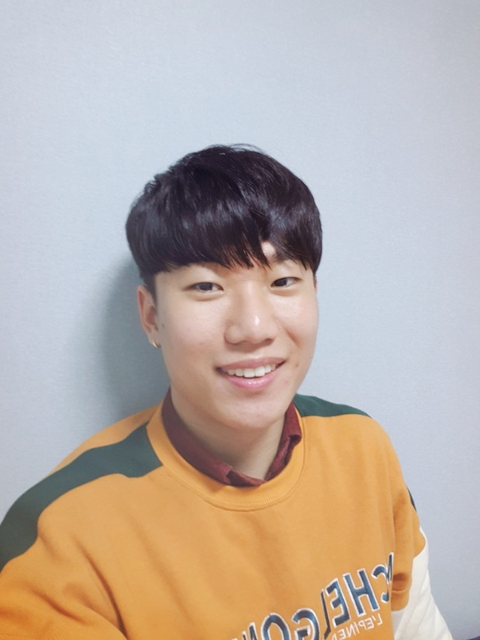

# ELSA (Elaborate Localization System Architectects)


## 1. 프로젝트 소개 (OLAF)
## 
>   
&nbsp; 본 프로젝트는 건물 내부에서 사용자가 원하는 목적지까지 <b>길을 안내하는 로봇</b>을 제작하는 것을 목표로 한다.<br/><br/>
&nbsp;매년 들어오는 신입생 및 외부인들은 캠퍼스 안내지도, 핸드폰 GPS 등을 통해 건물을 찾아오는 것은 쉽게 할 수 있다. 하지만 학과 건물과 같은 대규모 실내 공간에서는 종종 길을 헤매기도 한다. 우리는 이러한 사람들을 위해 실내에서 사용자들이 원하는 목적지까지 안내해 주는 로봇을 제작해 정확하고 빠르게 목적지까지 안내하여 편의성을 높이려 한다. 사용자는 앱을 통해 안내로봇(OLAF)과 통신을 하고 OLAF에게 목적지를 알려주면 OLAF는 목적지까지 최단경로로 안내해 준다. 사용자는 처음 방문하는 건물이지만 길을 헤매지 않고 목적지까지 도달 할 수 있다.<br/><br/><br/><br/>

## 2. Abstract

>   Our project goal is to build a robot that guides the way indoors to user. Robots are based on trutlebot3.
Robots have LiDAR sensor, camera, Encoder and IMU sensors. The core technologies of robots are localization, SLAM and navigation.
SLAM stands for 'Simultaneous Localization and Mapping'. The SLAM receives values direction from IMU, acceleration and angular velocity from Encoder, surrounding environment data from LiDAR. Then robots localizate themselves and create maps. To do localiztion, first obtain the local map through SLAM.
Then, for localization, compare the value measured in real time through LiDAR with the local map. It is not safe to localize only one LiDAR sensor. So robots calculates direction with the IMU and calculates accelation and angular velocity with the Encoder to modify robots position whenever robots move.
To do navigation, robots use local map created by SLAM and position calculated by localization. First, robots receive the destination from the user through the app. Second, The robot creates waypoints between its position and destination. Finally, Robots move to the destination use shortest path algorithm. If robots meet obstacle, robots avoid obstacles.If the camera detects the obstacles during the navigation, robots will move to the destination after avoiding obstacles.


## 3. 소개 영상


- [Youtube](https://youtu.be/V9RMH4tUaUQ/) 계획서발표
- [Youtube](https://youtu.be/tdBFq6ZRJdE/) 중간보고서
- [Youtube](https://youtu.be/EMOXelOuhhg/) 2차 중간 시연 영상
- [Youtube](https://youtu.be/pPz9lZsde4Q/) 2차 중간평가 발표 + 시연 영상
- [Youtube](https://youtu.be/QH6-VXfbB1o/) 최종 발표 영상
- [Youtube](https://youtu.be/_80_dxk4334/) 최종 홍보 영상
- [Youtube](https://youtu.be/ugHmFtuxD78/) 최종 시연 영상

## 4. 팀 소개

### Professor : 주용수




```markdown
* Name: 김다훈
* Student ID: 20153155
* Email: 
* Role:
  - 하드웨어 설계 제작
  - Point op node 제작
  - OpenCR Firmware
  - Data Share Protocol
    
```


```markdown
* Name: 김선필
* Student ID: 20143038
* Email: ksp2246@kookmin.ac.kr
* Role:
  - 하드웨어 설계 제작
  - Point op node 제작
  - Path Calculation
  - Lane Detection
  - RoomNum 인식
```


```markdown
* Name: 김명수
* Student ID: 20133199
* Email: msbmkim@gmail.com
* Role:
  - AWS Setting
  - Web Server UX / UI
  - JSON Server
  - Data Share Protocol
    
```


```markdown
* Name: 배한울
* Student ID: 20153184
* Email: gksdnf0407@gmail.com
* Role:
  - 하드웨어 설계 제작
  - Point op node 제작
  - OpenCR Firmware
  - Obstacle Detection
    
```


```markdown
* Name: 윤찬우
* Student ID: 20153202
* Email: ycw1879@kookmin.ac.kr
* Role:
  - 하드웨어 설계 제작
  - YOLO
  - Lane Detection
  - Obstacle Detection
    
```  


## 5. 사용법

- Opencr Driver Install
```markdown
    export OPENCR_PORT=/dev/ttyACM0
    export OPENCR_MODEL=olaf
    rm -rf ./opencr_update.tar.bz2
    wget https://github.com/kookmin-sw/capstone-2020-11.git/opencr_update.tar.bz2
    tar -xvf opencr_update.tar.bz2
    cd ./opencr_update
```

- Opencr Setup
```markdown
    cd /dev
    sudo chmod 777 ttyACM0
    ls -al | grep ttyACM0

    cd opencr_update
    export OPENCR_PORT=/dev/ttyACM0
    export OPENCR_MODEL=olaf
    sudo ./update.sh $OPENCR_PORT $OPENCR_MODEL.opencr
```

- Launch Tele Operation
```markdown
    roslaunch turtlebot3_bringup turtlebot3_robot.launch
    rosrun turtlebot3_teleop olaf_teleop_key
```

- VNC Setup
```markdown
    * insert options
    sudo gedit /etc/modprobe.d/bcmdhd.conf

    >> options bcmdhd op_mode=2

    * nvidia tx2
    ifconfig -> inet address check
    10.42.0.1

    * setting hotspot in xytron pdf
    wifi name : olaf
    wifi pw : nvidia123

    * remote PC
    turn on REMMINA
    새로만들기

    서버 : 10.42.0.1
    비밀번호 : nvidia
    색깊이 : 256색상 

    * 해상도 조절
    xrandr --fb 1280x720
```

- Jetson Tx2 Board Fan On
```markdown
    sudo ./jetson_clocks.sh
```

- Yolo and Lane Detection
```markdown
    * Upper and Lower Camera
    roslaunch usb_cam test.launch
    
    * Lane Detection
    rosrun vision lane_detection.py
    
    * Yolo
    roslaunch yolo_ros yolo_test_rosbag.launch
    rosrun yolo_ros yolo_steering.py
```

- Obstacle Detection
```markdown
    rosrun turtlebot3_example turtlebot3_obstacle
```

- Play Sound
```markdown
    roslaunch sound_play soundplay_node.launch
    rosrun sound_play play.py
```

- Auto-Driving
```markdown
    rosrun run_olaf olaf_object_detect
```
