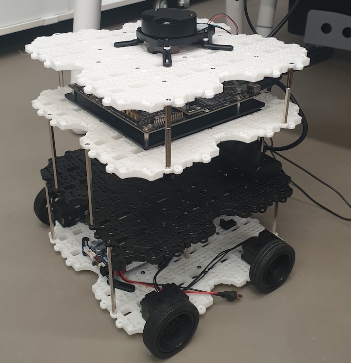

# ELSA (Elaborate Localization System Architectects)

## Olaf 
</img>


## 2020년 캡스톤 디자인 11조

### 1. 프로젝트 소개 (Olaf)

- Olaf
  - Olaf는 국민대학교의 건물 안에서 도움이 필요한 사람들에게 길안내를 할 수 있는 로봇입니다.

### 2. 소개 영상

- [Youtube](https://youtube.com, "Project Olaf")

### 3. 팀 소개

## Professor : 주용수

## 김다훈

</img>

```markdown
* Student ID: 20153155
* Email: as1084089@kookmin.ac.kr
* Role: 
```
## 김선필

</img>

```markdown
* Student ID: 20143038
* Email: ksp2246@kookmin.ac.kr
* Role: 
```

## 김명수

</img>

```markdown
* Student ID: 20133199
* Email: msbmkim@gmail.com
* Role: 
```

## 배한울

</img>

```markdown
* Student ID: 20153184
* Email: gksdnf0407@gmail.com
* Role: 
```

## 윤찬우

</img>

```markdown
* Student ID: 20153202
* Email: ycw1879@kookmin.ac.kr
* Role: 
```

### 4. 사용법

- 소스코드제출시 설치법이나 사용법을 작성하세요.

### 5. 기타

- 추가적인 내용은 자유롭게 작성하세요.
